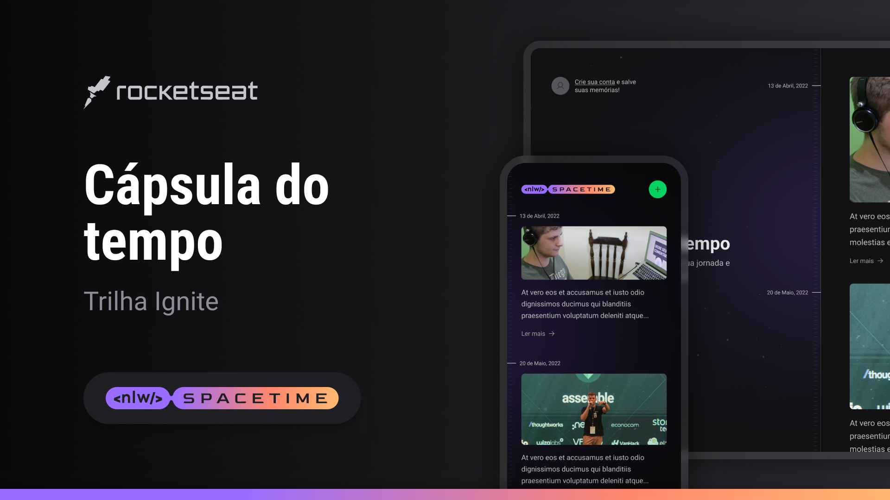

<h1 align="center"> NLW Setup - SpaceTime </h1>

Evento exclusivo e gratuito, promovido pela Rocketseat para ensino de tecnologias WEB.

  <a href="#-tecnologias">Tecnologias</a>&nbsp;&nbsp;&nbsp;|&nbsp;&nbsp;&nbsp;
  <a href="#-projeto">Projeto</a>&nbsp;&nbsp;&nbsp;|&nbsp;&nbsp;&nbsp;
  <a href="#-layout">Layout</a>

  

## 🚀 Tecnologias

Esse projeto foi desenvolvido com as seguintes tecnologias:

- HTML e CSS
- [Node e NPM](https://nodejs.org/)
- [React](https://pt-br.reactjs.org/)
- [React Native](https://pt-br.reactjs.org/)
- [TypeScript](https://www.typescriptlang.org/)
- [Expo](https://www.typescriptlang.org/)
- [Tailwind](https://tailwindcss.com/)

## 💻 Projeto

O Projeto Spacetime é uma emocionante iniciativa online que visa criar uma cápsula do tempo digital. Ele oferece a você a oportunidade de enviar suas lembranças, imagens e vídeos para serem preservados e compartilhados no futuro.

Imagine poder capturar momentos especiais da sua vida ou eventos significativos e guardá-los em um local seguro, onde você e outras pessoas poderão acessá-los anos mais tarde. O Projeto Spacetime torna isso possível, fornecendo uma plataforma interativa e envolvente.

## 🔖 Layout

Você pode visualizar o layout do projeto através [DESSE LINK](https://www.figma.com/community/file/1240070456276424762/C%C3%A1psula-do-tempo-%E2%80%A2-Trilha-Ignite). É necessário ter conta no [Figma](https://figma.com) para acessá-lo.

---

Feito no Bootcamp da Rocketseat :wave: [Participe da nossa comunidade!](https://discord.gg/rocketseat)
